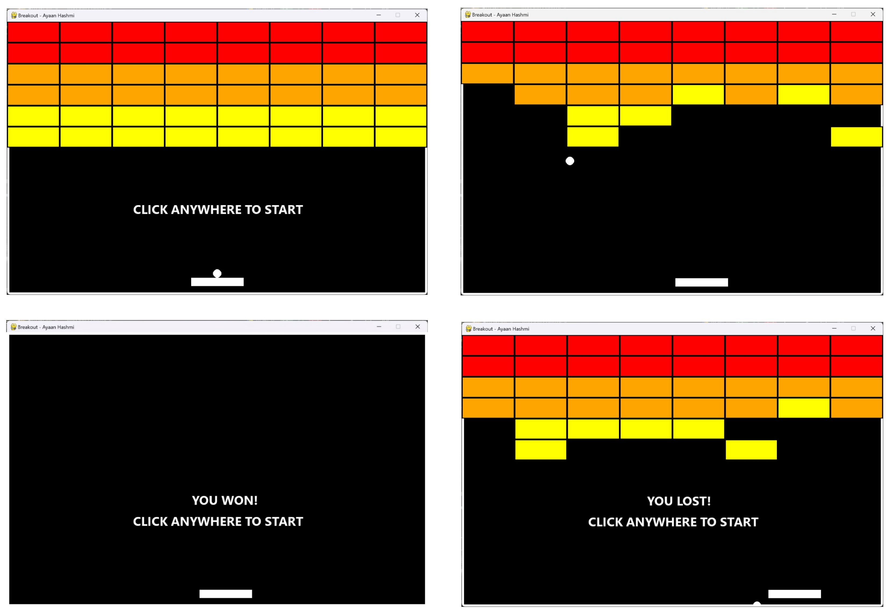

# Breakout - Ayaan Hashmi

## Overview

This is a recreation of the classic arcade game **Breakout** developed by **Ayaan Hashmi**. In this game, players control a paddle to bounce a ball and break all the bricks on the screen. The game features smooth controls and customizable levels to provide both nostalgia and a fresh gaming experience.

## Dependencies

- **Pygame:** For game development

## Getting Started

### Installation

1. **Clone the Repository:**

   ```
   git clone https://github.com/Ayaan-Hashmi/Breakout.git
   cd breakout
   ```

2. **Installing Dependencies:**

   ```
   pip install -r requirements.txt
   ```

3. **Run the game:**
   ```
   python breakout.py
   ```

### Controls:
Move Paddle Left: Left Arrow Key <br>
Move Paddle Right: Right Arrow Key <br>

### Current State:


Thank you for checking out this project! Have fun playing, and feel free to contribute or provide feedback.
